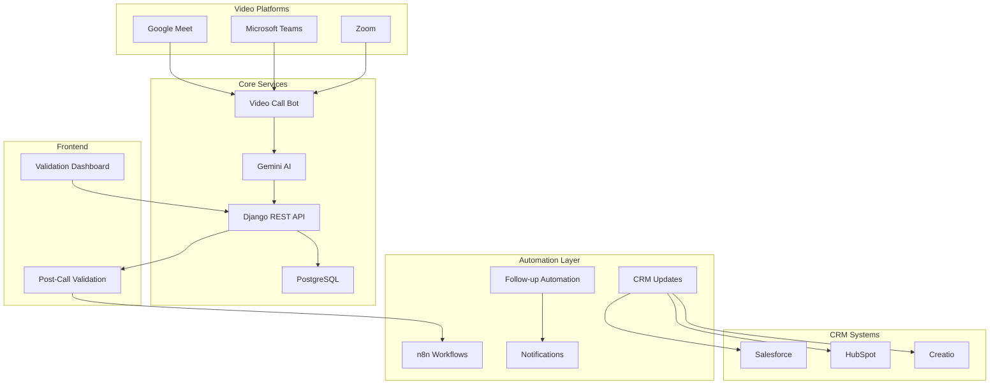
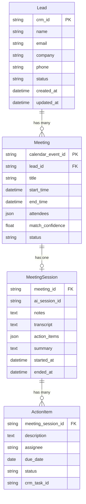

# Design Document

## Overview

NIA (AI Meeting Assistant) is an MVP meeting intelligence platform focused on the core validation loop. The system uses a video call bot to join meetings as a silent participant, generates AI-powered transcripts and summaries, conducts post-call validation sessions with sales reps, and only updates CRM systems after human approval. 

The platform follows a validation-first architecture with Django REST API as the backend, video call bot integration for transcription, React frontend for validation sessions, and n8n workflows for post-validation automation. The system supports multiple CRM platforms (Salesforce, HubSpot, Creatio) and handles up to 50 concurrent calls with 100% accuracy through human validation.

## Architecture

### High-Level Architecture



### Service Communication Patterns

1. **Synchronous Communication**: REST APIs for CRUD operations
2. **Asynchronous Communication**: Webhooks for event-driven workflows
3. **Real-time Communication**: WebSockets for live meeting assistance
4. **Background Processing**: Celery task queues for heavy operations

### Technology Stack

- **Video Call Bot**: Custom bot integration for Meet/Teams/Zoom
- **Backend**: Django 4.2+ with Django REST Framework
- **Database**: PostgreSQL 14+ for transcripts and validation data
- **AI Processing**: Google Gemini API for transcription and summary generation
- **Workflow Engine**: n8n for post-validation automation
- **Frontend**: React 18+ with TypeScript for validation interface
- **CRM Integration**: Multi-CRM API clients (Salesforce, HubSpot, Creatio)
- **Authentication**: OAuth2 for CRM APIs, secure credential management

## Components and Interfaces

### Core Backend Components

#### Video Call Bot Service
```python
class CallBotService:
    def join_meeting(meeting_url: str, platform: str) -> BotSession
    def start_transcription(session_id: str) -> TranscriptionStream
    def end_session(session_id: str) -> RawTranscript
    def handle_disconnection(session_id: str) -> PartialTranscript
```

#### Transcription Processing Service
```python
class TranscriptionService:
    def process_audio_stream(audio_data: bytes) -> TranscriptChunk
    def identify_speakers(transcript: str) -> SpeakerMapping
    def generate_draft_summary(transcript: str) -> DraftSummary
    def extract_action_items(transcript: str) -> List[ActionItem]
```

#### Validation Session Service
```python
class ValidationService:
    def create_validation_session(meeting_id: str) -> ValidationSession
    def present_summary_for_review(session_id: str) -> ValidationQuestions
    def capture_rep_feedback(session_id: str, responses: dict) -> ValidatedOutcome
    def finalize_meeting_data(session_id: str) -> FinalMeetingRecord
```

#### Multi-CRM Integration Service
```python
class CRMService:
    def update_salesforce(meeting_data: ValidatedOutcome) -> SyncResult
    def update_hubspot(meeting_data: ValidatedOutcome) -> SyncResult
    def update_creatio(meeting_data: ValidatedOutcome) -> SyncResult
    def format_for_crm(meeting_data: ValidatedOutcome, crm_type: str) -> CRMPayload
```

### n8n Workflow Interfaces

#### Lead Sync Workflow (lead-sync.json)
```json
{
  "trigger": "schedule:15min",
  "nodes": [
    {
      "name": "Creatio API Fetch",
      "type": "http-request",
      "parameters": {
        "url": "{{$env.CREATIO_API_URL}}/leads",
        "authentication": "oauth2"
      }
    },
    {
      "name": "Transform Data",
      "type": "function",
      "parameters": {
        "functionCode": "// Transform Creatio format to Django format"
      }
    },
    {
      "name": "Django Webhook",
      "type": "webhook",
      "parameters": {
        "httpMethod": "POST",
        "path": "/api/leads/sync"
      }
    }
  ]
}
```

#### Meeting Creation Workflow (meeting-creation.json)
```json
{
  "trigger": "webhook:google-calendar",
  "nodes": [
    {
      "name": "Lead Matching",
      "type": "http-request",
      "parameters": {
        "url": "{{$env.DJANGO_API_URL}}/api/meetings/match-lead",
        "method": "POST"
      }
    },
    {
      "name": "Create Meeting Record",
      "type": "http-request",
      "parameters": {
        "url": "{{$env.DJANGO_API_URL}}/api/meetings/",
        "method": "POST"
      }
    }
  ]
}
```

### Frontend Component Architecture

#### Meeting Dashboard Component
```typescript
interface MeetingDashboardProps {
  meetings: Meeting[];
  syncStatus: SyncStatus;
  onManualMatch: (meetingId: string, leadId: string) => void;
}

const MeetingDashboard: React.FC<MeetingDashboardProps> = ({
  meetings,
  syncStatus,
  onManualMatch
}) => {
  // Component implementation
};
```

#### Meeting Interface Component
```typescript
interface MeetingInterfaceProps {
  meetingId: string;
  lead: Lead;
  aiSession: AISession;
}

const MeetingInterface: React.FC<MeetingInterfaceProps> = ({
  meetingId,
  lead,
  aiSession
}) => {
  // Real-time meeting interface with WebSocket connection
};
```

### API Endpoints

#### Lead Management APIs
- `GET /api/leads/` - List leads with pagination
- `POST /api/leads/sync` - Webhook for n8n lead sync
- `GET /api/leads/{id}/meetings` - Get meetings for a lead
- `PUT /api/leads/{id}/status` - Update lead status

#### Meeting Management APIs
- `GET /api/meetings/` - List meetings with filters
- `POST /api/meetings/` - Create new meeting
- `POST /api/meetings/match-lead` - Match meeting to lead
- `GET /api/meetings/{id}/session` - Get meeting session data
- `POST /api/meetings/{id}/start` - Start meeting session
- `POST /api/meetings/{id}/end` - End meeting session

#### AI Assistant APIs
- `POST /api/ai/initialize` - Initialize AI session
- `POST /api/ai/questions` - Get suggested questions
- `POST /api/ai/notes` - Process meeting notes
- `POST /api/ai/summary` - Generate meeting summary

## Data Models

### Core Data Models

#### Meeting Model
```python
class Meeting(models.Model):
    meeting_url = models.URLField()
    platform = models.CharField(max_length=50)  # 'meet', 'teams', 'zoom'
    title = models.CharField(max_length=300)
    start_time = models.DateTimeField()
    end_time = models.DateTimeField()
    attendees = models.JSONField(default=list)
    status = models.CharField(max_length=50, default='scheduled')
    created_at = models.DateTimeField(auto_now_add=True)
    
    class Meta:
        indexes = [
            models.Index(fields=['start_time']),
            models.Index(fields=['platform']),
        ]
```

#### Call Bot Session Model
```python
class CallBotSession(models.Model):
    meeting = models.OneToOneField(Meeting, on_delete=models.CASCADE)
    bot_session_id = models.CharField(max_length=100, unique=True)
    join_time = models.DateTimeField()
    leave_time = models.DateTimeField(null=True)
    connection_status = models.CharField(max_length=50)
    raw_transcript = models.TextField(blank=True)
    speaker_mapping = models.JSONField(default=dict)
    
    class Meta:
        indexes = [
            models.Index(fields=['join_time']),
            models.Index(fields=['connection_status']),
        ]
```

#### Draft Summary Model
```python
class DraftSummary(models.Model):
    bot_session = models.OneToOneField(CallBotSession, on_delete=models.CASCADE)
    ai_generated_summary = models.TextField()
    extracted_action_items = models.JSONField(default=list)
    suggested_next_steps = models.TextField(blank=True)
    suggested_crm_updates = models.JSONField(default=dict)
    confidence_score = models.FloatField()
    created_at = models.DateTimeField(auto_now_add=True)
```

#### Validation Session Model
```python
class ValidationSession(models.Model):
    draft_summary = models.OneToOneField(DraftSummary, on_delete=models.CASCADE)
    sales_rep_email = models.EmailField()
    validation_questions = models.JSONField(default=list)
    rep_responses = models.JSONField(default=dict)
    validated_summary = models.TextField(blank=True)
    approved_crm_updates = models.JSONField(default=dict)
    validation_status = models.CharField(max_length=50, default='pending')
    started_at = models.DateTimeField()
    completed_at = models.DateTimeField(null=True)
    
    class Meta:
        indexes = [
            models.Index(fields=['validation_status']),
            models.Index(fields=['sales_rep_email']),
        ]
```

#### CRM Sync Record Model
```python
class CRMSyncRecord(models.Model):
    validation_session = models.ForeignKey(ValidationSession, on_delete=models.CASCADE)
    crm_system = models.CharField(max_length=50)  # 'salesforce', 'hubspot', 'creatio'
    sync_status = models.CharField(max_length=50, default='pending')
    crm_record_id = models.CharField(max_length=200, blank=True)
    sync_payload = models.JSONField(default=dict)
    error_message = models.TextField(blank=True)
    synced_at = models.DateTimeField(null=True)
    
    class Meta:
        indexes = [
            models.Index(fields=['crm_system', 'sync_status']),
        ]
```

### Database Schema Relationships



## Error Handling

### Error Categories and Strategies

#### External API Errors
- **Creatio CRM API**: Exponential backoff with max 5 retries, fallback to cached data
- **Google Calendar API**: Rate limit handling, token refresh automation
- **Gemini AI API**: Graceful degradation, fallback to basic note-taking

#### Workflow Error Handling
```javascript
// n8n Error Handling Pattern
{
  "onError": "continueErrorOutput",
  "retryOnFail": true,
  "maxTries": 3,
  "waitBetweenTries": 1000,
  "errorWorkflow": "error-notification-workflow"
}
```

#### Database Error Handling
- Connection pooling with automatic reconnection
- Transaction rollback for data integrity
- Read replica fallback for query operations

#### Real-time Communication Errors
- WebSocket reconnection with exponential backoff
- Message queuing during disconnection
- Graceful degradation to polling mode

## Testing Strategy

### Unit Testing
- **Backend**: Django TestCase with factory_boy for model testing
- **Frontend**: Jest and React Testing Library for component testing
- **Workflows**: n8n workflow testing with mock external APIs

### Integration Testing
- **API Integration**: Test external API connections with staging environments
- **Workflow Integration**: End-to-end workflow testing with test data
- **Database Integration**: Test data consistency across services

### End-to-End Testing
- **User Journey Testing**: Selenium tests for complete lead-to-meeting workflow
- **Performance Testing**: Load testing with realistic data volumes
- **AI Integration Testing**: Test AI responses with sample meeting scenarios

### Testing Data Strategy
```python
# Factory for test data generation
class LeadFactory(factory.django.DjangoModelFactory):
    class Meta:
        model = Lead
    
    name = factory.Faker('name')
    email = factory.Faker('email')
    company = factory.Faker('company')
    crm_id = factory.Sequence(lambda n: f"CRM_{n}")
```

### Performance Testing Targets
- Lead sync: Process 1000 leads in <5 minutes
- Meeting matching: <2 seconds per meeting
- AI response time: <3 seconds for suggestions
- WebSocket latency: <100ms for real-time updates
- Database queries: <500ms for complex joins

### Security Testing
- OAuth2 token validation and refresh testing
- API rate limiting verification
- Data encryption validation
- SQL injection prevention testing
- XSS protection verification