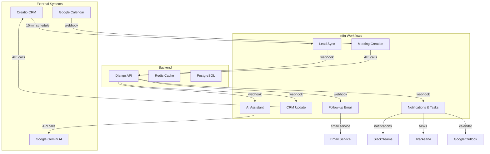

# n8n Workflow Configurations

This directory contains the n8n workflow configurations for the Intelligent Meeting Workflow System. These workflows automate the entire lead-to-meeting lifecycle with proper error handling and retry logic.

## Implemented Workflows

### 1. Lead Sync Workflow (`lead-sync.json`) ✅
- **Purpose**: Synchronizes leads from Creatio CRM to Django backend every 15 minutes
- **Trigger**: Scheduled (15-minute intervals)
- **Features**:
  - OAuth2 authentication with Creatio API
  - Data transformation from Creatio format to Django format
  - Exponential backoff retry logic
  - Error logging and notifications
  - Webhook delivery to Django API

### 2. Meeting Creation Workflow (`meeting-creation.json`) ✅
- **Purpose**: Automatically matches Google Calendar events to leads and creates meeting records
- **Trigger**: Google Calendar webhook
- **Features**:
  - Lead-to-meeting matching with confidence scoring
  - Meeting record creation in Django
  - Notification system for successful matches
  - Manual review flagging for unmatched events
  - Error handling for API failures

### 3. AI Assistant Workflow (`ai-assistant.json`) ✅
- **Purpose**: Initializes AI sessions when meetings start
- **Trigger**: Meeting start webhook
- **Features**:
  - AI session initialization with lead context
  - Graceful degradation when AI service is unavailable
  - Context-aware question generation
  - Fallback mode with basic questions
  - Exponential backoff retry for network errors
  - Comprehensive error categorization and logging

### 4. CRM Update Workflow (`crm-update.json`) ✅
- **Purpose**: Updates Creatio CRM with meeting outcomes and creates follow-up tasks
- **Trigger**: Meeting completion webhook
- **Features**:
  - Meeting outcome formatting for CRM fields
  - Automatic follow-up task creation from action items
  - Follow-up date calculation based on meeting outcomes
  - Comprehensive error handling (auth, network, rate limits)
  - Sync status tracking in Django
  - Notification system for success/failure

### 5. Follow-up Email Automation Workflow (`follow-up-email.json`) ✅
- **Purpose**: Automatically drafts and sends follow-up emails after validation completion
- **Trigger**: Validation completion webhook
- **Features**:
  - Dynamic email template generation based on meeting outcomes
  - Approval mechanism for high-priority emails (closed_won, demo_scheduled, proposal_requested)
  - Immediate vs delayed sending logic based on outcome priority
  - Email personalization with meeting context and action items
  - Integration with email service and comprehensive error handling
  - Email logging and delivery status tracking
  - Notification system for approval requests and send status

### 6. Notification and Task Creation Workflow (`notification-task-creation.json`) ✅
- **Purpose**: Sends meeting summaries to team channels and creates follow-up tasks
- **Trigger**: Meeting summary notification webhook
- **Features**:
  - Multi-channel notifications (Slack, Teams) with rich formatting
  - Project management integration (Jira, Asana) for automatic task creation
  - Calendar invite generation for follow-up meetings (Google Calendar, Outlook)
  - Priority-based task assignment and due date management
  - Comprehensive error handling and retry logic
  - Activity logging and status tracking

## Workflow Architecture



## Error Handling Strategy

All workflows implement comprehensive error handling:

1. **Retry Logic**: Exponential backoff for transient errors
2. **Error Categorization**: Different handling for auth, network, validation errors
3. **Graceful Degradation**: Fallback modes when services are unavailable
4. **Logging**: Detailed error logging to Django backend
5. **Notifications**: Real-time notifications for critical failures

## Testing

Each workflow includes comprehensive test suites:

- **Unit Tests**: Python test files for workflow logic validation
- **Integration Tests**: JSON test configurations for n8n testing
- **Mock Data**: Realistic test scenarios with various error conditions
- **Performance Tests**: Validation of execution time and resource usage

### Running Tests

```bash
# Run AI Assistant workflow tests
python n8n_workflows/tests/test_ai_assistant_workflow.py

# Run CRM Update workflow tests  
python n8n_workflows/tests/test_crm_update_workflow.py

# Run Follow-up Email workflow tests
python n8n_workflows/tests/test_follow_up_email_workflow.py

# Run Notification and Task Creation workflow tests
python n8n_workflows/tests/test_notification_task_creation_workflow.py
```

## Configuration

### Environment Variables Required

```bash
# Django Backend
DJANGO_API_URL=https://your-django-api.com

# Creatio CRM
CREATIO_API_URL=https://your-creatio-instance.com/api

# Google Gemini AI
GEMINI_API_KEY=your-gemini-api-key

# Email Service
EMAIL_SERVICE_URL=https://your-email-service.com

# Frontend URL for approval links
FRONTEND_URL=https://your-frontend-app.com

# Slack Integration
SLACK_WEBHOOK_URL=https://hooks.slack.com/services/your-webhook
SLACK_SALES_CHANNEL=#sales-updates

# Microsoft Teams Integration
TEAMS_WEBHOOK_URL=https://outlook.office.com/webhook/your-webhook

# Jira Integration
JIRA_API_URL=https://your-company.atlassian.net
JIRA_PROJECT_KEY=SALES
JIRA_ENABLED=true

# Asana Integration
ASANA_API_URL=https://app.asana.com/api/1.0
ASANA_PROJECT_ID=your-project-id
ASANA_ENABLED=true

# Google Calendar Integration
GOOGLE_CALENDAR_API_URL=https://www.googleapis.com/calendar/v3
GOOGLE_CALENDAR_ENABLED=true

# Outlook Calendar Integration
OUTLOOK_CALENDAR_API_URL=https://graph.microsoft.com/v1.0
OUTLOOK_CALENDAR_ENABLED=true

# Notifications
NOTIFICATION_WEBHOOK_URL=https://your-notification-service.com/webhook
```

### Credentials Setup

1. **Django API Key**: HTTP Header authentication for Django backend
2. **Creatio OAuth2**: OAuth2 credentials for CRM API access
3. **Google Calendar**: OAuth2 for calendar webhook access
4. **Gemini AI**: API key for AI service integration
5. **Email Service**: API key or authentication for email sending service
6. **Slack**: Webhook URL for Slack notifications
7. **Microsoft Teams**: Webhook URL for Teams notifications
8. **Jira**: OAuth2 or API token for Jira integration
9. **Asana**: Personal access token for Asana integration
10. **Google Calendar**: OAuth2 for Google Calendar integration
11. **Outlook Calendar**: OAuth2 for Outlook Calendar integration

## Deployment

1. Import workflow JSON files into n8n instance
2. Configure environment variables
3. Set up credential authentication
4. Enable webhook endpoints
5. Test with staging data before production

## Monitoring

Each workflow includes monitoring capabilities:

- **Execution Metrics**: Track workflow execution times and success rates
- **Error Rates**: Monitor failure rates by error type
- **Performance**: Track API response times and resource usage
- **Business Metrics**: Monitor lead sync rates, matching accuracy, CRM update success

## Maintenance

- **Regular Updates**: Keep workflow configurations updated with API changes
- **Credential Rotation**: Regularly rotate OAuth2 tokens and API keys
- **Performance Tuning**: Adjust retry intervals and timeout values based on usage
- **Error Analysis**: Review error logs to identify and fix recurring issues

## Requirements Satisfied

This implementation satisfies the following requirements from the specification:

- **Requirement 1.1, 1.3, 1.4**: Lead synchronization with 15-minute intervals
- **Requirement 2.1, 2.2, 2.4**: Automatic meeting-lead matching
- **Requirement 3.1, 3.6**: AI session initialization with context
- **Requirement 4.1, 4.2, 4.4**: CRM updates and follow-up task creation
- **Requirement 4.1, 4.2, 8.5**: Follow-up email automation with approval workflow
- **Requirement 4.3, 4.4, 4.5, 4.6**: Notification and task creation automation
- **Requirement 7.1, 7.2, 7.3**: Workflow automation and reliability

All workflows include proper error handling, retry logic, and monitoring as specified in the requirements.